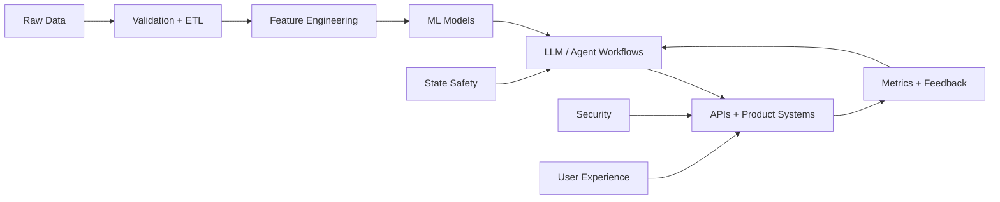
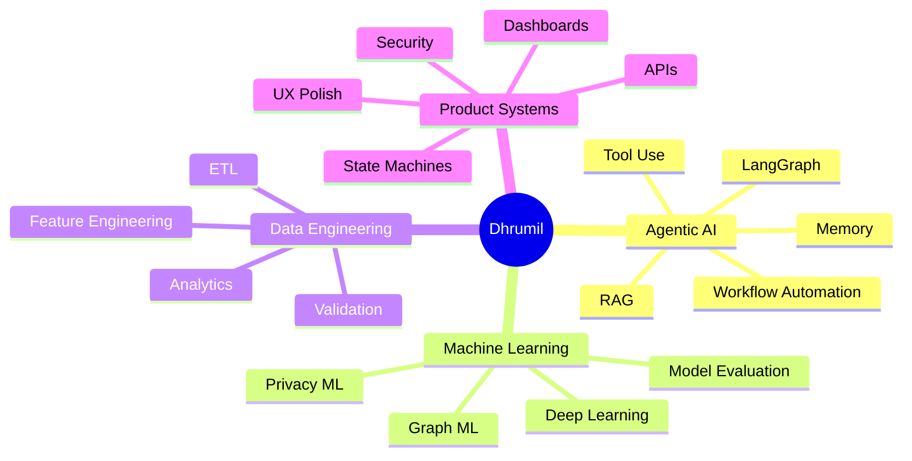

<div align="center">


<br/>


<br/>
<br/>

[](https://www.linkedin.com/in/dhrumil-rana-265316232/)
[](mailto:dhrumilrana25@gmail.com)
[](https://github.com/dhrumilrana25)
[](#)

<br/>
<br/>


</div>

<br/>

---

<br/>

<div align="center">


</div>

<br/>

---

<br/>

<div align="center">

## 🛰️ Mission Profile


</div>

<br/>

<table>
<tr>
<td width="58%" valign="top">

### 👨‍🚀 About Me

I am an **AI Systems & Machine Learning Engineer** pursuing a **Master’s in Data Science at the University of Texas at Arlington**.

I build intelligent systems across the full stack: from **data pipelines and ML models** to **agentic workflows, production APIs, dashboards, and automation systems**.

My focus is simple:

> Turn messy real-world data and workflows into scalable, reliable, production-ready intelligence.

Currently, I am working as an **AI Engineer at NovaChatAI**, building AI-powered creator automation systems, dashboard intelligence, media monetization workflows, campaign automation, and safer production architecture.

</td>

<td width="42%" valign="top">

### ⚡ Current Orbit

```txt
Role       : AI Engineer @ NovaChatAI
Degree     : MS Data Science @ UT Arlington
Focus      : Agentic AI + ML Systems
Stack      : Python, TypeScript, Next.js, Postgres
Strength   : Turning ideas into shipped systems
Mindset    : Build clean. Test carefully. Scale safely.
```

<br/>

<div align="center">


</div>

</td>
</tr>
</table>

<br/>

---

<br/>

<div align="center">

## 🚀 Current Build Zone


</div>

<br/>

<table>
<tr>
<td width="50%" valign="top">

### 🧠 Agentic AI Systems

Building workflows with memory, tool use, routing, state management, and production-safe behavior.

**Current focus**

* Multi-step AI workflows
* Context-aware automation
* Agent routing and fallbacks
* Human + AI handoff logic

</td>
<td width="50%" valign="top">

### 📊 ML + Data Engineering

Designing pipelines that move from raw data to features, models, metrics, and insights.

**Current focus**

* ETL and validation
* Feature engineering
* Model evaluation
* Graph ML and privacy ML

</td>
</tr>

<tr>
<td width="50%" valign="top">

### ⚙️ Backend + Reliability

Building APIs and stateful systems that handle edge cases, retries, scheduling, and consistency.

**Current focus**

* PostgreSQL/Supabase systems
* Idempotent state machines
* API workflows
* Security-aware architecture

</td>
<td width="50%" valign="top">

### 🎨 Product Engineering

Creating clean, responsive, data-rich interfaces that feel premium and make complex workflows simple.

**Current focus**

* Next.js dashboards
* Tailwind UI systems
* Creator workflow UX
* Dark/light responsive polish

</td>
</tr>
</table>

<br/>

---

<br/>

<div align="center">

## 🧭 System Thinking

</div>

<br/>



<br/>

<div align="center">


</div>

<br/>

---

<br/>

<div align="center">

## 🛠️ Technical Arsenal

<br/>


<br/>
<br/>

</div>

<table>
<tr>
<td width="33%" valign="top">

### 🧩 Languages


</td>
<td width="33%" valign="top">

### 🤖 AI / ML


</td>
<td width="33%" valign="top">

### ⚙️ Systems


</td>
</tr>
</table>

<br/>

---

<br/>

<div align="center">

## 🏗️ Production Work: NovaChatAI


</div>

<br/>

<table>
<tr>
<td width="50%" valign="top">

### 🎛️ Dashboard Systems

Redesigned **8+ production modules** across onboarding, auth, settings, subscribers, scripts, messages, and media workflows.

**Impact**

* Cleaner creator workflows
* Better responsiveness
* Improved usability
* More polished product experience

</td>
<td width="50%" valign="top">

### 🖼️ Media Intelligence

Built media monetization workflows including labeling, gallery/list views, previews, filtering, and PPV media rendering.

**Impact**

* Faster content navigation
* Better media visibility
* Cleaner sales workflows
* Stronger creator-side control

</td>
</tr>

<tr>
<td width="50%" valign="top">

### 💬 Messaging Automation

Improved AI-assisted messaging UI, creator controls, PPV sales context, draft/send behavior, and conversation polish.

**Impact**

* Better AI-human workflow
* Improved creator messaging speed
* Clearer PPV context
* More stable user experience

</td>
<td width="50%" valign="top">

### 📣 Mass Messaging Systems

Working on bulk campaign workflows with audience selection, media pricing, scheduling, history, revenue metrics, and AI-awareness.

**Impact**

* Campaign intelligence
* Audience targeting
* Monetization tracking
* AI context alignment

</td>
</tr>

<tr>
<td width="50%" valign="top">

### 📜 Script Automation

Working on safer script automation with state tracking, pause/resume/exit behavior, scheduled sends, and idempotency guards.

**Impact**

* Fewer duplicate states
* Safer automation
* Better scheduler reliability
* More predictable AI workflows

</td>
<td width="50%" valign="top">

### 🔐 Security + Reliability

Supported post-breach hardening through auth validation, role-aware behavior, protected route thinking, and safer workflows.

**Impact**

* Reduced exposed surfaces
* Safer creator/admin behavior
* Better production discipline
* More reliable workflow design

</td>
</tr>
</table>

<br/>

---

<br/>

<div align="center">

## 💎 Flagship Projects


</div>

<br/>

<table>
<tr>
<td width="50%" valign="top">

### 🏭 Agentic-Cleanse Factory

**Autonomous Multi-Agent ETL System with Self-Healing Logic**

Built an LLM-powered data quality engine that automates cleaning, validation, schema mapping, and transformation.

**Highlights**

* Multi-agent ETL workflow using **LangGraph + Groq**
* Agents for outlier detection, schema mapping, and validation
* Recursive correction workflows for self-healing pipelines
* Reduced manual data processing effort by **80%**

**Stack:** Python, LangGraph, Groq, Streamlit, Pandas

<br/>

<a href="https://github.com/dhrumilrana25/Agentic-Cleanse">

</a>

</td>
<td width="50%" valign="top">

### 🧬 Aegis-Federate

**Privacy-Preserving Multimodal Federated Learning System**

Designed a decentralized training system where models learn across silos without raw data sharing.

**Highlights**

* Federated learning with **Flower + gRPC + Docker**
* Multimodal architecture using **1D-CNN + MLP**
* Differential Privacy using **DP-SGD with Opacus**
* Built around secure distributed intelligence

**Stack:** Python, Flower, gRPC, Docker, PyTorch, Opacus

<br/>

<a href="https://github.com/dhrumilrana25/Aegis-Federate">

</a>

</td>
</tr>

<tr>
<td width="50%" valign="top">

### 🐦 Twitter-Scale Link Prediction Engine

**Graph ML Engine for Social Discovery**

Built a graph embedding pipeline for predicting missing links in large-scale social network data.

**Highlights**

* Processed a **1.2M-node social graph**
* Generated **1M+ random walks**
* Built DeepWalk embeddings with graph heuristics
* Engineered a **1028-dimensional feature space**
* Achieved **0.887 AUC**

**Stack:** Python, Graph ML, DeepWalk, Scikit-learn, NetworkX

<br/>

<a href="https://github.com/dhrumilrana25/Twitter-Scale-Link-Prediction-Engine">

</a>

</td>
<td width="50%" valign="top">

### 🛡️ IoT Malware Detection

**Behavioral Network Analytics for Intrusion Detection**

Built a malware detection pipeline using network behavior features and classification modeling.

**Highlights**

* Analyzed **1.1M+ network connections**
* Used information theory for feature reduction
* Reduced 23 features to top predictive features
* Achieved **95.38% classification accuracy**

**Stack:** Python, Scikit-learn, Pandas, NumPy, Network Analytics

<br/>

<a href="https://github.com/dhrumilrana25/IoT-Malware-Detection-Network-Analytics">

</a>

</td>
</tr>
</table>

<br/>

<div align="center">

<a href="https://github.com/dhrumilrana25/Agentic-Cleanse">
  
</a>

<a href="https://github.com/dhrumilrana25/Aegis-Federate">
  
</a>

<a href="https://github.com/dhrumilrana25/Twitter-Scale-Link-Prediction-Engine">
  
</a>

<a href="https://github.com/dhrumilrana25/IoT-Malware-Detection-Network-Analytics">
  
</a>

</div>

<br/>

---

<br/>

<div align="center">

## 🧪 Experience Timeline

</div>

<br/>

<table>
<tr>
<td width="30%" valign="top">

### 2026 — Present

**AI Engineer**
NovaChatAI

</td>
<td width="70%" valign="top">

* Redesigned 8+ production dashboard modules across onboarding, auth, settings, subscribers, scripts, messages, and media workflows.
* Built media monetization workflows including labeling, gallery/list views, previews, PPV rendering, filtering, and messaging UI.
* Resolved 50+ production-facing frontend and workflow issues.
* Supported security hardening around auth validation, route exposure, role-aware behavior, and safer workflows.
* Working on mass messaging systems, AI-aware campaigns, and script automation state reliability.

</td>
</tr>

<tr>
<td width="30%" valign="top">

### 2024

**Software Developer Intern**
Odoo

</td>
<td width="70%" valign="top">

* Developed Python-based backend modules for POS and inventory workflows.
* Optimized PostgreSQL queries and backend logic, achieving a **15% transaction speed increase**.
* Resolved **50+ critical defects** in production environments.
* Designed REST APIs for real-time frontend-backend communication.

</td>
</tr>

<tr>
<td width="30%" valign="top">

### 2024

**Research Analyst**
Silent Infotech Pvt. Ltd.

</td>
<td width="70%" valign="top">

* Built an end-to-end Python ETL pipeline processing **100k+ records across 20+ features**.
* Integrated OpenAI GPT APIs to automate content generation workflows.
* Reduced manual processing time by **80%**.
* Developed validation pipelines using Pandas and NumPy.

</td>
</tr>
</table>

<br/>

---

<br/>

<div align="center">

## 🎓 Education

</div>

<br/>

<table>
<tr>
<td width="50%" valign="top" align="center">

### 🎓 University of Texas at Arlington

**Master of Science in Data Science**
January 2025 – July 2026

</td>
<td width="50%" valign="top" align="center">

### 🎓 Government Engineering College Modasa

**Bachelor of Engineering in Information Technology**
November 2020 – May 2024

</td>
</tr>
</table>

<br/>

---

<br/>

<div align="center">

## 📊 GitHub Telemetry

<br/>


<br/>
<br/>


<br/>
<br/>


<br/>
<br/>


</div>

<br/>

---

<br/>

<div align="center">

## 🧩 Builder DNA

</div>

<br/>



<br/>

---

<br/>

<div align="center">

## 🌌 Beyond Code

<br/>

<table>
<tr>
<td align="center" width="25%">
<h3>🌌 Space</h3>
<p>Rockets, deep-tech, futuristic systems</p>
</td>
<td align="center" width="25%">
<h3>🎮 Gaming</h3>
<p>Story-based games and high-performance systems</p>
</td>
<td align="center" width="25%">
<h3>🏸 Sports</h3>
<p>Badminton, volleyball, competition mindset</p>
</td>
<td align="center" width="25%">
<h3>🏎️ F1</h3>
<p>Strategy, analytics, optimization</p>
</td>
</tr>
</table>

</div>

<br/>

---

<br/>

<div align="center">

## 📬 Connect With Me

<br/>


<br/>
<br/>

[](https://www.linkedin.com/in/dhrumil-rana-265316232/)
[](mailto:dhrumilrana25@gmail.com)
[](https://github.com/dhrumilrana25)

<br/>
<br/>

### “Building intelligent systems that scale from raw data to real-world impact.”

<br/>


</div>
