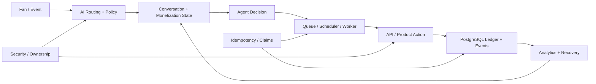
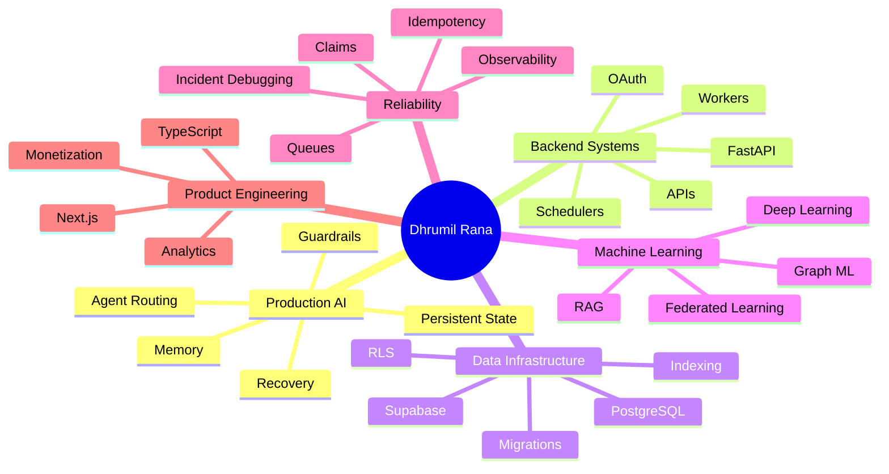

<div align="center">


<br/>


<br/>
<br/>

[](https://www.linkedin.com/in/dhrumil-rana-265316232/)
[](mailto:dhrumilrana25@gmail.com)
[](https://github.com/dhrumilrana25)
[](#)

<br/>


</div>

<br/>

---

<br/>

<div align="center">

## 🛰️ MISSION CONTROL

### Founding AI Systems Engineer @ NovaChatAI


</div>

<br/>

<table>
<tr>
<td width="58%" valign="top">

### 👨‍💻 About Me

I am a **Founding AI Systems Engineer** working across production AI, backend infrastructure, data systems, and product engineering.

At **NovaChatAI**, I own architecture and delivery across conversational AI, messaging, scripts, PPV monetization, media, subscribers, campaigns, analytics, authentication, background workers, and recovery systems.

My work is centered on one principle:

> **AI becomes useful only when model decisions can be translated into safe, observable, recoverable product actions.**

I completed my **M.S. in Data Science at the University of Texas at Arlington** in July 2026.

</td>

<td width="42%" valign="top">

### ⚡ Current Orbit

```txt
Role       : Founding AI Systems Engineer
Company    : NovaChatAI
Degree     : M.S. Data Science — UT Arlington
Focus      : Agentic AI + Backend Systems
Core       : Python / FastAPI / PostgreSQL
Product    : Next.js / TypeScript / Supabase
Mindset    : State first. Idempotent. Observable.
```

<br/>

<div align="center">


</div>

</td>
</tr>
</table>

<br/>

---

<br/>

<div align="center">

## 📡 PRODUCTION PROOF


</div>

<br/>

<table>
<tr>
<td align="center" width="25%">

### 100+

**Production defects & chokepoints resolved**

Frontend, backend, database, AI execution, auth, workers, APIs, monetization.

</td>

<td align="center" width="25%">

### 9K+

**Queued AI jobs investigated**

Worker saturation, cron concurrency, queue state, backlog recovery.

</td>

<td align="center" width="25%">

### 8+

**Production surfaces owned**

Messaging, scripts, PPV, media, subscribers, campaigns, analytics, auth.

</td>

<td align="center" width="25%">

### 1.2M

**Graph nodes processed**

1M+ DeepWalk sequences and 0.887 ROC AUC.

</td>
</tr>
</table>

<br/>

---

<br/>

<div align="center">

## 🧠 WHAT I ENGINEER

</div>

<br/>

<table>
<tr>
<td width="50%" valign="top">

### 01 — AI ORCHESTRATION

Stateful conversational and monetization flows combining:

* Conversation state
* Purchase context
* Memory
* Routing logic
* Script state
* PPV state
* Follow-up and re-engagement
* Safe execution fallbacks

The objective is not merely better model output.

It is **controlled AI behavior inside a real product**.

</td>

<td width="50%" valign="top">

### 02 — DISTRIBUTED EXECUTION

Reliable asynchronous workflows across:

* Background workers
* Queues
* Cron and schedulers
* Claim-based execution
* Retry and recovery paths
* Attempt history
* Lifecycle controls
* Idempotency guards

I design systems expecting partial failure, duplication, stale state, and retries.

</td>
</tr>

<tr>
<td width="50%" valign="top">

### 03 — DATA + SECURITY

Relational infrastructure using:

* PostgreSQL
* Supabase
* Foreign keys
* Partial indexes
* Safe migrations
* Row-Level Security
* Private schemas
* Scoped roles
* Session-derived identity
* Ownership validation

Data models are designed around **state, execution history, auditability, and recovery**.

</td>

<td width="50%" valign="top">

### 04 — PRODUCT SYSTEMS

Production-facing systems across:

* Next.js
* TypeScript
* React
* Creator messaging
* Media workflows
* Campaign automation
* Subscriber controls
* Analytics
* Authentication
* Monetization UX

I care about the full chain:

**model → backend → database → UI → user outcome**

</td>
</tr>
</table>

<br/>

---

<br/>

<div align="center">

## 🏗️ PRODUCTION AI ARCHITECTURE


</div>

<br/>



<br/>

<div align="center">

### Reliable AI requires persistent state, deterministic safeguards, and recoverable execution.

</div>

<br/>

---

<br/>

<div align="center">

## 🏢 NOVACHATAI — PRODUCTION SYSTEMS


</div>

<br/>

<table>
<tr>
<td width="50%" valign="top">

### 🧠 Stateful AI + Monetization

Engineered conversation and monetization flows across:

* Relationship building
* Scripts
* PPV offers
* Purchase and pending state
* Follow-ups
* Re-engagement
* Memory and routing
* AI execution safeguards

</td>

<td width="50%" valign="top">

### ⚙️ Automation Reliability

Eliminated duplicate and conflicting execution through:

* Persistent fan state
* Database-enforced uniqueness
* Partial indexes
* Idempotency guards
* Scheduler lifecycle controls
* Routing fallbacks
* Recovery-safe execution

</td>
</tr>

<tr>
<td width="50%" valign="top">

### 📣 Campaign + Messaging Systems

Architected workflows for:

* Mass messaging
* Audience targeting
* Campaign scheduling
* Delivery attempts
* Monetization state
* Conversion attribution
* AI awareness
* Execution history

</td>

<td width="50%" valign="top">

### 🔐 Security + Authorization

Reworked authorization around:

* Session-derived identity
* Creator ownership validation
* Private PostgreSQL schemas
* Row-Level Security
* Scoped roles
* Internal service authorization
* Safer external integration paths

</td>
</tr>

<tr>
<td width="50%" valign="top">

### 🚨 Production Incident Recovery

Diagnosed a major AI-response outage with **9,000+ queued jobs** by tracing:

* Cron concurrency
* Worker saturation
* Queue state
* Database state
* Scheduler behavior
* Processing throughput

Verified successful backlog drainage after recovery.

</td>

<td width="50%" valign="top">

### 📊 Data + Analytics

Designed relational systems for:

* Campaign recipients
* Delivery attempts
* Script runs
* Scheduling
* PPV and purchase state
* Revenue attribution
* Recovery
* Execution history
* Product analytics

</td>
</tr>
</table>

<br/>

---

<br/>

<div align="center">

## 🛠️ TECHNICAL ARSENAL

<br/>


<br/>
<br/>

</div>

<table>
<tr>
<td width="33%" valign="top">

### 🤖 AI / ML


</td>

<td width="33%" valign="top">

### ⚙️ Backend / Data


</td>

<td width="33%" valign="top">

### 🧩 Systems / Product


</td>
</tr>
</table>

<br/>

---

<br/>

<div align="center">

## 💎 FLAGSHIP PROJECTS


</div>

<br/>

<table>
<tr>
<td width="50%" valign="top">

### 🏭 Agentic-Cleanse Factory

**Autonomous Data Quality Engine**

Stateful multi-agent data engineering system using **LangGraph + LLMs** for profiling, anomaly detection, schema reasoning, transformation, validation, and self-correction.

**Highlights**

* Multi-agent orchestration
* Human-in-the-loop approval
* Runtime error feedback
* Self-healing ETL
* Deterministic validation
* **80% reduction in manual processing effort**

**Stack:** Python, LangGraph, Groq, Streamlit, Pandas

<br/>

<a href="https://github.com/dhrumilrana25/Agentic-Cleanse">

</a>

</td>

<td width="50%" valign="top">

### 🧬 Aegis-Federate

**Privacy-Preserving Federated Intelligence**

Cross-silo federated learning system where models learn collaboratively without centralizing raw data.

**Highlights**

* Flower + gRPC orchestration
* Dockerized edge nodes
* 1D-CNN + MLP multimodal model
* DP-SGD with Opacus
* Gradient clipping + controlled noise
* Privacy / utility evaluation

**Stack:** PyTorch, Flower, gRPC, Docker, Opacus

<br/>

<a href="https://github.com/dhrumilrana25/Aegis-Federate">

</a>

</td>
</tr>

<tr>
<td width="50%" valign="top">

### 🐦 Twitter-Scale Link Prediction Engine

**Large-Scale Graph Machine Learning**

Graph learning pipeline across **1.2M nodes** using DeepWalk and structural graph signals.

**Highlights**

* **1M+ DeepWalk sequences**
* **1,028-dimensional representation**
* Embeddings + graph topology
* Random Forest classification
* **0.887 ROC AUC**

**Stack:** Python, DeepWalk, NetworkX, Scikit-learn

<br/>

<a href="https://github.com/dhrumilrana25/Twitter-Scale-Link-Prediction-Engine">

</a>

</td>

<td width="50%" valign="top">

### 🛡️ IoT Malware Detection

**Behavioral Network Analytics**

Machine learning pipeline for detecting malicious IoT network behavior using information theory and interpretable classification.

**Highlights**

* **1.1M+ network connections**
* High-cardinality feature removal
* Mutual Information ranking
* Behavioral feature engineering
* **95.38% accuracy**
* **0.95 ROC AUC**

**Stack:** Python, Scikit-learn, Pandas, NumPy

<br/>

<a href="https://github.com/dhrumilrana25/IoT-Malware-Detection-Network-Analytics">

</a>

</td>
</tr>
</table>

<br/>

<div align="center">

<a href="https://github.com/dhrumilrana25/Agentic-Cleanse">

</a>

<a href="https://github.com/dhrumilrana25/Aegis-Federate">

</a>

<br/>

<a href="https://github.com/dhrumilrana25/Twitter-Scale-Link-Prediction-Engine">

</a>

<a href="https://github.com/dhrumilrana25/IoT-Malware-Detection-Network-Analytics">

</a>

</div>

<br/>

---

<br/>

<div align="center">

## 🧪 EXPERIENCE

</div>

<br/>

<table>
<tr>
<td width="28%" valign="top">

### 2026 — Present

**Founding AI Systems Engineer**

NovaChatAI

</td>

<td width="72%" valign="top">

* Own architecture and delivery across **8+ production surfaces**
* Resolved **100+ production defects and functionality chokepoints**
* Built stateful AI conversation and monetization workflows
* Designed relational systems for campaigns, scripts, execution history, and recovery
* Built idempotency and scheduler lifecycle protections
* Diagnosed and recovered a **9,000+ queued-job AI-response outage**
* Reworked session identity, ownership validation, private schemas, RLS, and scoped roles

</td>
</tr>

<tr>
<td width="28%" valign="top">

### 2024

**Software Developer Intern**

Odoo

</td>

<td width="72%" valign="top">

* Built Python backend modules for POS and inventory workflows
* Developed REST APIs and PostgreSQL business logic
* Resolved **50+ production defects**
* Improved transaction performance by **15%**

</td>
</tr>

<tr>
<td width="28%" valign="top">

### 2024

**Research Analyst**

Silent Info Tech Pvt. Ltd.

</td>

<td width="72%" valign="top">

* Built an end-to-end ETL pipeline for **100K+ records across 20+ features**
* Integrated OpenAI models into content-processing workflows
* Reduced measured manual processing effort by **80%**
* Built validation and analytics pipelines using Pandas and NumPy

</td>
</tr>
</table>

<br/>

---

<br/>

<div align="center">

## 🎓 EDUCATION

</div>

<br/>

<table>
<tr>
<td width="50%" align="center" valign="top">

### 🎓 University of Texas at Arlington

**Master of Science in Data Science**

January 2025 — July 2026

</td>

<td width="50%" align="center" valign="top">

### 🎓 Government Engineering College Modasa

**Bachelor of Engineering in Information Technology**

November 2020 — May 2024

</td>
</tr>
</table>

<br/>

---

<br/>

<div align="center">

## 🧬 ENGINEERING DNA

</div>

<br/>



<br/>

---

<br/>

<div align="center">

## 📊 GITHUB TELEMETRY

<br/>


<br/>
<br/>


<br/>
<br/>


<br/>
<br/>


</div>

<br/>

---

<br/>

<div align="center">

## 🤝 OPEN TO BUILDING

<br/>


<br/>

I am open to collaborating with serious builders on **RAG, Agentic AI, automation, data infrastructure, ML systems, and production-ready AI projects**.

The kind of project I want to build:

**Retrieval → Agents → Tools → State → APIs → Evaluation → Deployment**

Not another basic chatbot.

A complete system.

<br/>
<br/>

[](https://www.linkedin.com/in/dhrumil-rana-265316232/)

[](mailto:dhrumilrana25@gmail.com)

[](https://github.com/dhrumilrana25)

<br/>
<br/>

### “Models generate possibilities. Systems turn them into reliable outcomes.”

<br/>


</div>
